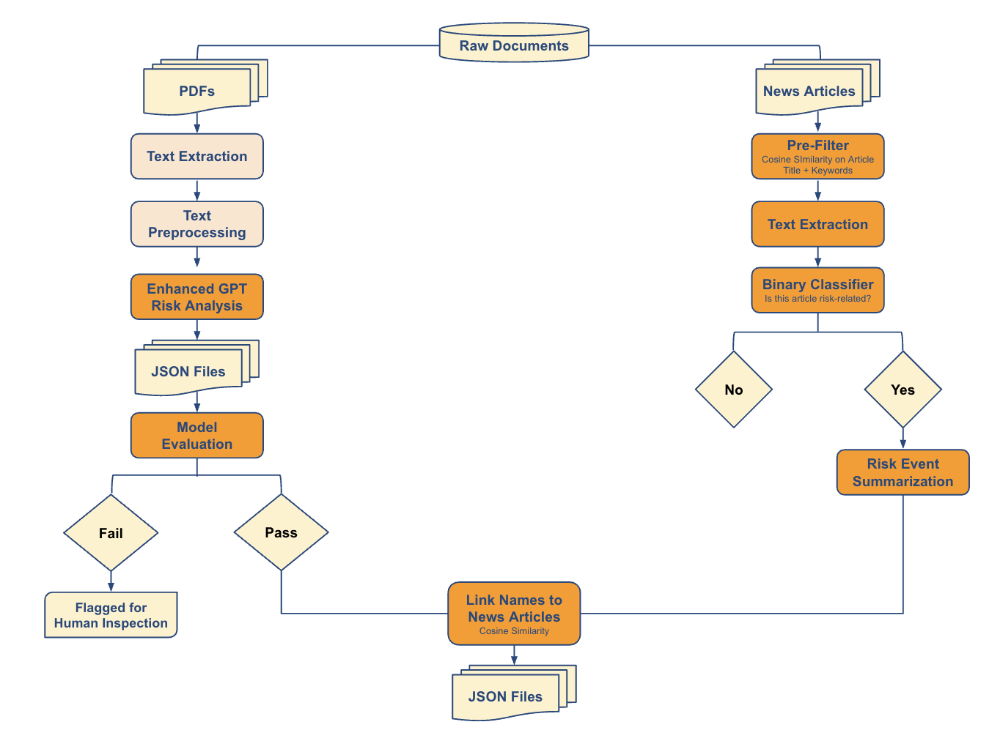

# Data Science for Social Good - ERA Project

This repository outlines the 2025 DSSG project, partnered with the ERA team. 

The project streamlines the automated process for risk extraction on textual data (PDF reports & web articles). 

## Workflow Overview 
The high-level overview on the final product can be seen in the workflow diagram below. 

## Table of Contents 
1. [Classifier](/classifier) : Classification Model for Web Articles
2. [Data](/data) : Input data and results files for the overarching pipeline
3. [Evaluation](/evaluation) : Model and prompt evaluation folders
4. [Images](/images) : Contains workflow diagram
5. [PDF Scraper](/pdf_scraper) : Includes contents of PDF preprocessing
6. [Risk Analysis](/risk_analysis) : Main folder for GPT risk analysis
7. [Risk Pairing](/risk_pairing) : Pairing of website risk events with extracted PDF risks
8. [Web Scraper](/web_scraper) : Website scraping tool

## Key Components 
### 1. Classification Model (`classifier/`)
- Main file to run classifier on website articles (`run_classifier.py`)
- Consists of two versions:
    - `scripts/gpt_main.py`: GPT classifier (base)
    - `scripts/catboost_main.py`: Catboost semi-supervised model (v2)
- `classified.json`: Tracking of files already classified
- `output/`: Output website files from classifier model
- Function: Joins all web-scraped files, cleans content through REGEX, feeds into classifier -> saves filtered content & its metadata
### 2. Evaluation (`evaluation/`)
- Runs scripts for LLM-as-a-judge, using GPT model as a proxy for a human evaluator (`evaluation_main.py`)
- Function:
  
### 3. GPT Risk Analysis (`risk_analysis/`)
- Initializes overall GPT risk analysis on PDF reports (`run_risk_analysis.py`)
- Contains two versions:
  - `file_input.py`: Analysis through file input
  - `file_search.py`: Analysis through file search
- `processed_files.txt`: Tracker for all processed reports
- `output/`: Risk analysis output, each subfolder contains the output for a specific input method and pass configuration. The folder names indicate both the input type (file input, file search) and the number of processing passes performed during the analysis. The naming convention follows this pattern:
    - File input 1: Results from file input processing with a single pass
    - File search txt 2: Results from text file search processing with 2 passes
- Function: Take the input folder for pdfs, iterate through the PDF folder using a for loop to identify all unprocessed PDF files. For each unprocessed PDF, execute the risk analysis using the specified method (file input, file search) and designated number of passes (1, 2).

### 4. Summarizing Website Articles (`risk_pairing/`)
- Summarizes each article content (`scripts/news_article_summarization.py`)

### 5. Linking Web and PDF Content (`risk_pairing/`)
- Links website content to PDF extracted risks (`/scripts/link_websites_to_risks.py`) 

### 6. Web-Scraping Tool (`web_scraper/`)
- Main running script to start web-scraping (`run_scraper.py`)
- Consists of two versions:
  - `scraper/website_scraper.py`: Uses BeautifulSoup + Playwright for dynamically rendered content (base)
  - `scraper/dynamic_web_scraper.py`: Implements loading buttons + pagination (v2)
- `output/urls/visited_urls.json`: Tracker for all visited URLS
- `output/raw_results/`: Results for all raw web-scraped content 
- Updates Google Sheets on Mckinsey PDF reports to manually check 
- Function: Takes input, extracts title, content, url & date -> saves file for each source per run

### 7. Data
(`data/`)
- Input:
  - `inputs/pdfs`: All PDF reports to run
  - `inputs/text`: Text files of PDF reports
  - `inputs/websites/urls.json`: URL configuration for website branch
- Results: Extracted PDF risk files with linked website risk events

### 8. OpenAI models
- `classifier/model/chat4o_mini.py`: Uses **GPT 4o-mini model** to classify risk-relevant articles
- `evaluation/scripts/llm_as_judge.py`: **GPT 4** implemented for LLM-as-a-judge evaluation
- `risk_analysis/file_input.py`: Risk analysis through file input run on **GPT 4.1 mini** (default)
- `risk_analysis/file_search.py`: Risk analysis through file search run on **GPT 4.1 mini** (default)

## Installation Instructions 
1. Clone this repository
3. Create and activate a virtual environment
   - Currently configured for `Python 3.13`
4. Install dependencies from `requirements.txt`

## Usage Guide
1. Run `main.py`
2. Specify which branch of the workflow you'd like to run:
   - If you'd just like to run the website section + linkage -> type `web`
   - If you'd just like to run the PDF extraction -> type `pdf`
   - If you'd like to run the whole process -> run web branch first then pdf
